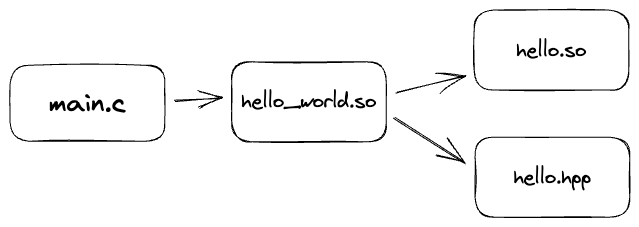
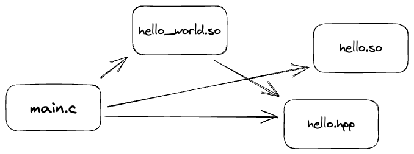
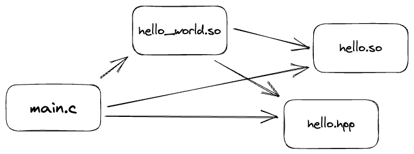

- [[Network]]
	- Scan the open TCP ports of a specified host
		- ```bash
		  nc -v -z ip_address port
		  ```
- [[CMake]]
	- `PRIVATE`, `PUBLIC`, and `INTERFACE`
		- `PRIVATE`: visible only to the target that they are specified in. They are not propagated to any targets that depend on that target.
		- `PUBLIC`: visible both to the target that they are specified in and to any targets that depend on that target.
		- `INTERFACE`: visible only to targets that depend on the target that they are specified in. They are not visible to the target that they are specified in.
		- > Libraries and targets following PUBLIC are linked to, and are made part of the link interface. Libraries and targets following PRIVATE are linked to, but are not made part of the link interface. Libraries following INTERFACE are appended to the link interface and are not used for linking <target>.
		  -- https://cmake.org/cmake/help/latest/command/target_link_libraries.html
		- Example:
			- Project dependency
				- 
			- `PRIVATE`:
				- 
			- `INTERFACE`:
				- 
			- `PUBLIC`:
				- 
				-
-