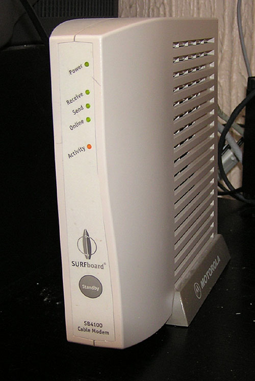

- [[Compiler]]
	- ### i386
		- Intel 80386
		- The i386's introduction of a 32-bit architecture, its widespread adoption, and its influence on future x86 processors have made it historically significant.
- [[Network]]
	- [[ADSL]]
		- Asymmetric Digital Subscriber Line
		- Different service use different frequency in a same telephone line
	- [[Cable Modem]]
		- Coaxial cable
		- 第四台
		- 
	- [[Fiber]]
	-