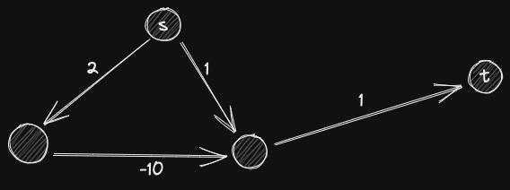

title:: Algorithm/Dijkstra

- 
  Source: [wikimedia](https://commons.wikimedia.org/wiki/File:Dijkstra_Animation.gif)
- # Pseudo Code
	- **function** Dijkstra(Graph, weight, source) {
	      Initial Distances Table (\inf if node \neq source else 0)
	      S: Set()
	      Q: Queue() Or something that help finding min distance
	      Q.Push(source)
	      **while** (!Q.Empty()) {
	          u \leftarrow Find Min Dist in Queue
	          S.Add(u)
	          **for** v adj with u {
	              Q.Push(v) if v need to relax
	          }
	      }
	  }
- # Note
	- Negative weight may lead to multiple relax time on a same node.
		- 
- # 2D Grid
	- `point = pair<int, int>`
	- `grid[x][y]` is cost of `(x, y)`
	- walk from `(0, 0)` to `(n-1, m-1)`
	- ## Trick
		- `pair<A, B>` has implement comparer if A and B is comparable
		- With specific comparer, priority_queue will pop min element: `priority_queue<T, vector<T>, greater<T>>`
		- stdc++17:
			- ```cpp
			  auto [x, y] = pair/[2]int;
			  ```
	- ## Code
		- [Leetcode: 2290. Minimum Obstacle Removal to Reach Corner](https://leetcode.com/problems/minimum-obstacle-removal-to-reach-corner/)
		- ```cpp
		  using pii = pair<int, int>;
		  using pipii = pair<int, pii>;
		  
		  class Solution {
		  public:
		      int minimumObstacles(vector<vector<int>>& grid) {
		          int m = grid.size();
		          int n = grid[0].size();
		          int inf = 1e5 + 1;
		  
		          vector<vector<int>> tab(m, vector<int>(n, inf));
		          tab[0][0] = 0;
		          
		          priority_queue<pipii, vector<pipii>, greater<pipii>> que;
		          que.push(pipii(0, pii(0, 0)));
		          
		          int dets[4][2] = {{0, 1}, {0, -1}, {1, 0}, {-1, 0}};
		          
		          while (!que.empty()) {
		              auto [v, p] = que.top();
		              auto [x, y] = p;
		              que.pop();
		                          
		              for(int lx = 0;lx < 4;++lx) {
		                  auto [dx, dy] = dets[lx];
		                  int nx = x + dx;
		                  int ny = y + dy;
		                  if (nx < 0 || nx >= m || ny < 0 || ny >= n) {
		                      continue;
		                  }
		                  
		                  if (tab[nx][ny] < inf) {
		                      continue;
		                  }
		                  
		                  int nv = v + grid[nx][ny];
		                  tab[nx][ny] = nv;
		                  que.push(pipii(nv, pii(nx, ny)));
		              }
		          }
		          
		          return tab[m-1][n-1];
		      }
		  };
		  ```