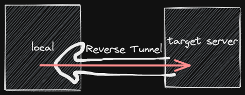

title:: Code Snippets/ssh

- Disable root login
	- ```bash
	  sed -i 's/PermitRootLogin yes/PermitRootLogin no/g' /etc/ssh/sshd_config
	  /etc/init.d/ssh restart
	  ```
- Tips: http://www.study-area.org/tips/ssh_tips.htm
- # SSH Tunnel: Port Forwarding
	- Parameters:
		- `-N`: Do not execute a remote command.
		- `-L [bind_address:]port:host:hostport`
	- Example: Forward server's local postgresql
		- 
		- card-last-interval:: -1
		  card-repeats:: 1
		  card-ease-factor:: 2.5
		  card-next-schedule:: 2022-09-02T16:00:00.000Z
		  card-last-reviewed:: 2022-09-02T09:49:47.217Z
		  card-last-score:: 1
		  ```bash
		  ssh -N -L 127.0.0.1:15432:localhost:5432 user@server.com
		  ```
		- Then link to `localhost:15432`
	- Example: ssh to target server through tunnel server
		- 
		- ```bash
		  ssh -N -L 19999:target.com:22 user@tunnel.com
		  ```
		- Then link to `localhost:19999`
	- ## Reverse SSH Tunnel
		- 
		- First execute this from target server
		  ```bash
		  ssh -R 19999:localhost:22 source@123.456.789.000
		  ```
		- Then execute this from source
		  ```bash
		  ssh localhost -p 19999
		  ```