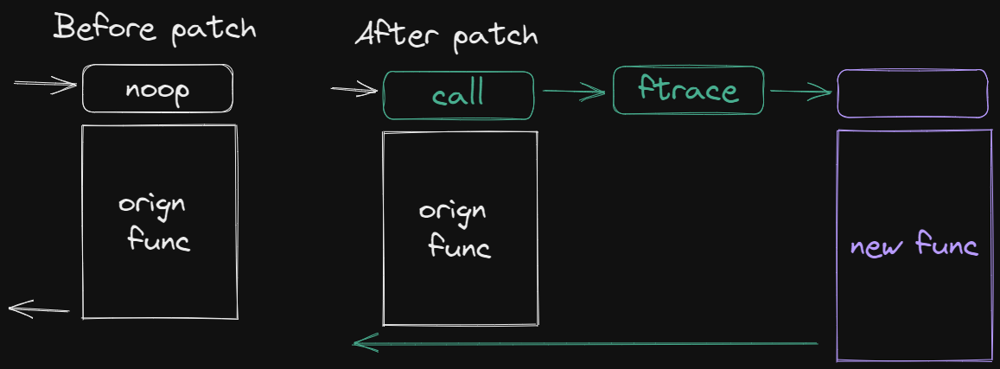

icon:: 🐧

- ## Folder Structure
  collapsed:: true
	- Source:
		- https://man7.org/linux/man-pages/man7/hier.7.html
		- https://linuxhandbook.com/linux-directory-structure/
	- Notes for some usually-using folders.
	- `/`: Root
		- `/bin`: Executables
		- `/boot`: Static files for boot loaders
		- `/dev`: Device files
			- `/dev/null`: Send to blackhole
			- `/dev/zero`: Infinite `0`
			- `/dev/random`: Infinite random values
		- `/etc`: Config files
		- `/home`: Directories for users
		- `/opt`: Optional packages
		- `/srv`: Service data
		- `/usr`: Sharable, read-only data
		- `/var`: Files what changes
			- `/var/log`: Log files
			- `/var/lib`: State info (ex: redis dump)
- ## Kernel Livepatch
  collapsed:: true
	- Patch kernel without reboot.
	- [Kernel Doc](https://www.kernel.org/doc/html/latest/livepatch/livepatch.html)
	- 
- ## Init vs Systemd
	- Source: [Init vs Systemd: What is an init daemon?](https://web.yueh.dev/learning/init-vs-systemd-what-is-an-init-daemon)
	- Init daemon
		- Start services sequencially.
		- Need to write a script under `/etc/init.d` to manage a service
	- Systemd
		- Start services parallel by a depend DAG of services.
		- Config under `/etc/systemd/system/`