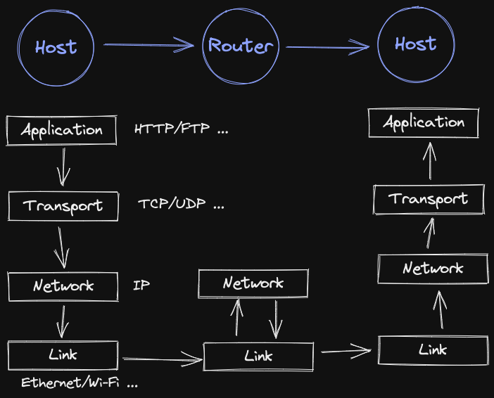

- # History
	- 196x: ARPANET borned.
	- 197x: TCP/IP Protocol, Router borned.
	- 198x:
		- TCP/IP v4 ([IPv4](((631053f0-eada-4f74-a8cd-8f9151642eb6))))
		- .com/.gov/.edu
	- 199x:
		- [IPv6](((6310582c-624f-4e35-aead-768e07ba34a8))) Proposal (need loooooooong time to migrate 🥲)
		- WWW
		- Windows
		- Search Engine
- # Open System Interconnection (OSI 7 Layers)
	- Well, this model is too strict. Sometimes we cannot map a protocol exactly to a layer.
	- ## (1) Physical Layer
		- Hardware
	- ## (2) Data-Link Layer
		- ex:
			- Point-to-Point Protocol (PPP)
			- ADSL = PPP over Ethernet = PPPoE
	- ## (3) Network Layer
		- ex: IP
	- ## (4) Transport Layer
		- ex: TCP, UDP
	- ## (5) Session Layer
		- Socket
	- ## (6) Presentation Layer
		- ex: UTF-8, ASCII
	- ## (7) Application Layer
		- ex: HTTP, HTTPS, FTP, SSH ...
- # TCP/IP
	- 
	  card-last-score:: nil
	  card-repeats:: 0
	  card-next-schedule:: nil
	  card-last-interval:: -1
	  card-ease-factor:: 2.5
	  card-last-reviewed:: nil
- # IP Address
	- Source:
		- https://en.wikipedia.org/wiki/IP_address
		- https://en.wikipedia.org/wiki/IPv4
	- ## IPv4
	  id:: 631053f0-eada-4f74-a8cd-8f9151642eb6
		- `[0-255].[0-255].[0-255].[0-255]`
		- Private Address:
			- `10.0.0.0/8`: 24 bits block
			- `172.16.0.0/12`: 20 bits block
				- Example:
					- docker default subnet: `172.17.0.0/16`
			- `192.168.0.0/16`: 16 bits block, many home router use this as default.
	- ## IPv6
	  id:: 6310582c-624f-4e35-aead-768e07ba34a8
		- `ffff:ffff:ffff:ffff:ffff:ffff:ffff:ffff`
		- According to [RFC 5952](https://www.rfc-editor.org/rfc/rfc5952.html#section-4.2.1), the shorten-form (compressed-form) can be unique if shorten by RFC 5952's rules:
			- [4.2.1](https://www.rfc-editor.org/rfc/rfc5952.html#section-4.2.1).  Shorten as Much as Possible
			- [4.2.3](https://www.rfc-editor.org/rfc/rfc5952.html#section-4.2.3).  Choice in Placement of `::`
			- [4.3](https://www.rfc-editor.org/rfc/rfc5952.html#section-4.3).  Lowercase
		- Zone ID
			- `fe08:9012:3451::1234%1`
			- Different network card can use different zone id: Two or more network cards in same device!
	- ## CIDR
		- **C**lassless **I**nter-**D**omain **R**outing
		- A Method to efficiently classify IPs.
- # Reference
	- https://web.ntnu.edu.tw/~499700326/Internethistory.htm
-