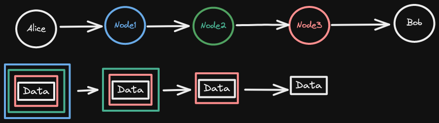

title:: Security/Tor

- ## What is Tor
	- An open source project: https://www.torproject.org/download/tor/
	- Surf the Net anonymously.
	- **The Onion Router**
- ## How it work
	- 
	- Hop 3 or more nodes before actually visit target server.
	- The target server only reveal in the latest node.
	- Like onion.
- ## How to use it
	- **Never** login to user-profiled website, ex:
		- Facebook
		- Google
		- ...
	- **Never** login **same** account in non-tor mode.
	- **Only** HTTPS
	- **No** BT
	- **Keep** Latest version of tor browser.
- ## Reference
	- https://hacyber.com/what-is-tor/