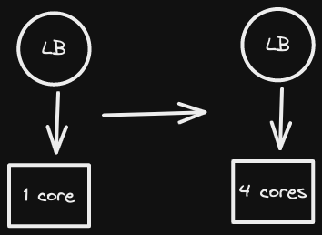
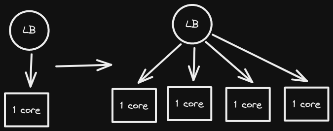

- ## DDD-style
	- Ref: https://slides.com/jalex-chang/go-clean-arch-cresclab
	-
- ## Scale Up vs Scale Out
  collapsed:: true
	- ### Scale Up
		- Upgrade Single machine's resource. Ex: cpu, memory, disks ...
		- 
	- ### Scale Out
		- Add more machines.
		- 
- ## Deployment Strategies
  collapsed:: true
	- Source: [Intro to Deployment Strategies: Blue-Green, Canary, and More](https://harness.io/blog/blue-green-canary-deployment-strategies)
	- ### The Basic Deployment
		- Just deploy new version to all nodes.
		- Pro: Simple, fast and cheap
		- Con: *The Rickiest*
		- Use this if the service
			- 1. is not revenue-critical or
			  2. has official off-hour
	- ### Rolling Deployment
		- Deploy new version to some nodes.
		- Pro: Simple to rollback
		- Con: Need to support old and new version.
	- ### Blue-Green Deployment
		- Prepare two enviroments: (Staging, Production). Swap them after deploy and test ok on staging.
		- Pro:
			- Simple, fast and cheap
			- Easy to rollback
		- Con:
			- Costly
	-
	-